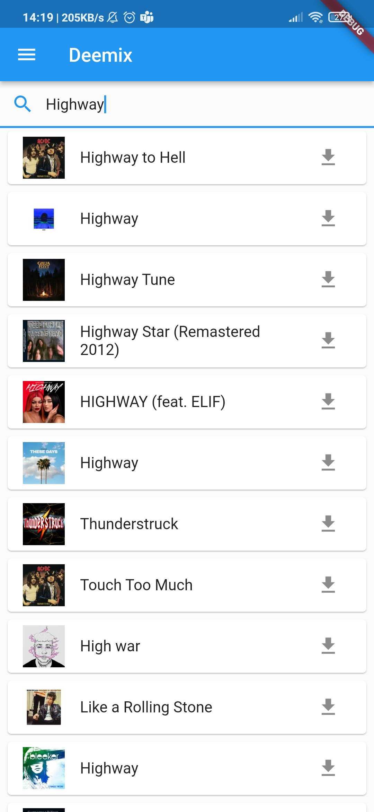
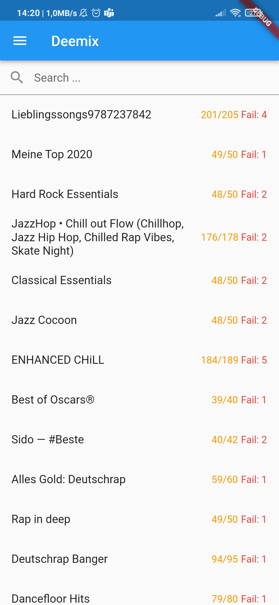
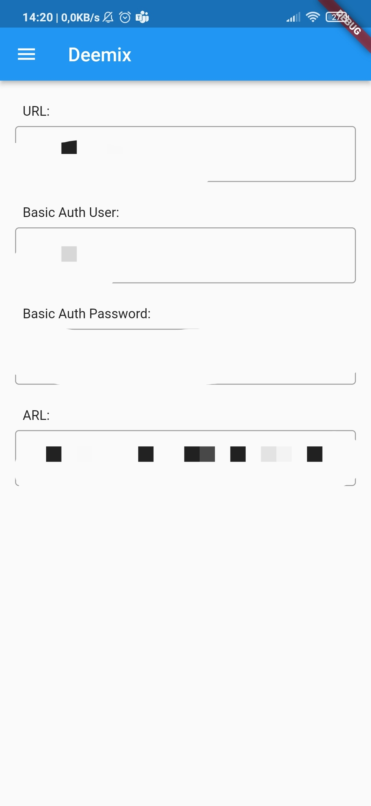

# deemix_android

Android client for your [Deemix](https://deemix.app/gui/) server.
It provides you an easy and simple interface to add new Downloads to your Deemix server.

This app is totally functionable,but more in a prototyping state.

# Installation
Go to [Actions](https://github.com/Y0ngg4n/deemix_android/actions/workflows/apk.yaml)
And select the latest run. 
There you can download the release-apk at the Artifacts section.

## Getting Started

This project is a starting point for a Flutter application.

A few resources to get you started if this is your first Flutter project:

- [Lab: Write your first Flutter app](https://docs.flutter.dev/get-started/codelab)
- [Cookbook: Useful Flutter samples](https://docs.flutter.dev/cookbook)

For help getting started with Flutter development, view the
[online documentation](https://docs.flutter.dev/), which offers tutorials,
samples, guidance on mobile development, and a full API reference.
